 
 

### Hey there <𝚌𝚘𝚍𝚎𝚛𝚜/>!

  

  <h1>
   
</h1>

  

<h1 style="font-family:Georgia, 'Times New Roman', Times, serif; font-weight:700; color:#e63946;">
  About me
</h1>

<table>
<tr>
<td width="40%" align="center">

</td>

<td width="60%" valign="top">

🔭 I’m currently working on <a href="https://anime-phillic.vercel.app">AnimePhillic</a>   

🌱 I’m currently learning <b>Spring Boot</b>  

👯 I’m looking to collaborate on <a href="https://wanderwise-lime.vercel.app">WanderWise</a>  

👨‍💻 My details are available at <a href="https://vivekgotstack.vercel.app">Portfolio</a>  

📝 I post content on <a href="https://twitter.com/vivekgotstack">Twitter</a>  

💬 Ask me about <b>Scaling Backends, Building Architectures</b>  

📫 How to reach me <b>vivekni1224@gmail.com</b>  

📄 Here's my resume <a href="https://drive.google.com/file/d/17dtJxAWSzLYbhqEBiZKF79ZhsgBl_2yQ/view?usp=drivesdk">Vivek's Resume</a>  

⚡ Fun fact: <b>I enjoy writing code so clean even my future self can understand it.</b>

</td>
</tr>
</table>

##### <h3> Connect:</h3>

<h2 align="center">
  
   Tech Arsenal 
  
</h2>

  <i>Tools I use to design, build, and scale software.</i>

##### Programming Languages:

  

<b>📊 Proficiency Matrix</b>

 

| Language | Proficiency | Use Cases |
|----------|-------------|-----------|
|  | ⭐⭐⭐⭐⭐ | Backend with Spring & SpringBoot |
|  | ⭐ | AI/ML, Backend (Just Started) |
|  | ⭐⭐⭐⭐⭐ | Web Development with React and TS |

##### Web Technologies:

  

 

  
##### Frameworks & Libraries:

  

 

  
##### Databases & Platforms:

  

 

  
##### ⚒️ Often Used Tech Tools ⚒️

  <a href="https://github.com/vivekgotstack" >
    
     
    
  </a>

##### Current Focus ️

  <table>
    <tr>
      <td align="center" width="96">
        
         React Apps
      </td>
      <td align="center" width="96">
        
         Rest Api
      </td>
      <td align="center" width="96">
        
         Docker
      </td>
      <td align="center" width="96">
        
         Java and Springboot
      </td>
      <td align="center" width="96">
        
         Open Source
      </td>
    </tr>
  </table>

 

  
  
  

    
  

## Featured Projects
  
  

    
  <table align="center">
  <tr>
    <!-- Latest Repositories -->
    <td width="50%" valign="top">
      <h3 align="center">⚡ Currently Building</h3>
      

        
          
      

    </td>
    <!-- Highlighted Work -->
    <td width="50%" valign="top">
      <h3 align="center">🌟 Highlighted Work</h3>
      

        
          
        
          
        
      

    </td>
  </tr>
</table>
 

### 💼 Project Highlights

<table>
  <tr>
    <td align="center" width="33%">
      
       <b>Java Backend Systems</b>
       Spring Boot, REST APIs, scalable architecture
    </td>
    <td align="center" width="33%">
      
       <b>Database Design</b>
       PostgreSQL, MySQL, schema design, optimization
    </td>
    <td align="center" width="33%">
      
       <b>Full Stack Applications</b>
       React, Spring Boot, REST integration
    </td>
  </tr>
</table>
 

<h2 align="center">⚡ Stats ⚡</h2>

  <picture>
    <source media="(prefers-color-scheme: dark)" srcset="https://raw.githubusercontent.com/vivekgotstack/vivekgotstack/output/github-contribution-grid-snake-dark.svg">
    <source media="(prefers-color-scheme: light)" srcset="https://raw.githubusercontent.com/vivekgotstack/vivekgotstack/output/github-contribution-grid-snake.svg">
    
  </picture>

 ### 💼 Open For

  <table>
    <tr>
      <td align="center">
         
        <b>Collaborations</b>
      </td>
      <td align="center">
         
        <b>Open Source</b>
      </td>
      <td align="center">
         
        <b>Full Stack Roles</b>
      </td>
      <td align="center">
         
        <b>Freelance Work</b>
      </td>
    </tr>
  </table>

 

##  Support My Work

  
If you find my projects useful, consider buying me a coffee! ☕

  

    

  ### ⭐ Star My Repositories

  
If you like what you see, don't forget to star my repositories!

  
  

 

 

#### Will learn as much as I can, Still have a long way to go.

 

  

